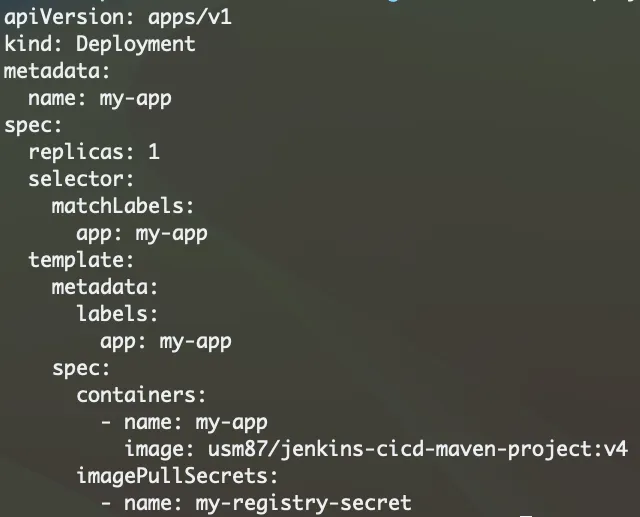

# Authenticate Kubenetes with Docker Hub

Step1: Create a secret

```
kubectl create secret docker-registry my-registry-secret --docker-username=DOCKER_USER --docker-password=DOCKER_PASSWORD --docker-email=DOCKER_EMAIL
```

Step 2:

Create a deployment file with “imagePullSecrets”

