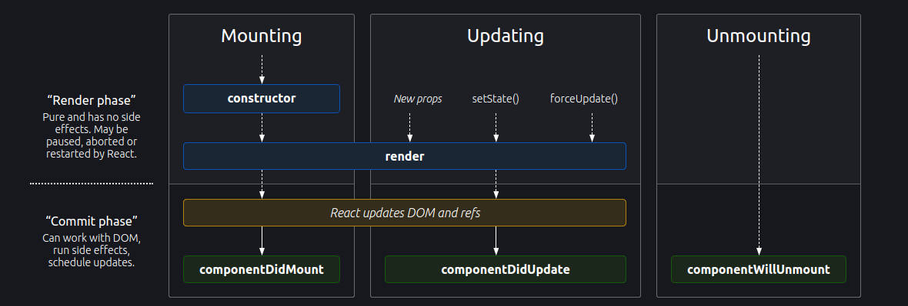

# Component

- Class Based Component (Old)
- Functional Component (New)

```
// React Component
const FunCom = () => <h1>Functional Component</h1>;

// React Element
const heading2 = <h1>Hello from JSX</h1>
```

- Component Composition is the adding a component inside another component.

## Functional Component

## Class Components

- In React, components have a lifecycle that includes several phases: mounting, updating, and unmounting.

- Each of these phases is associated with specific methods that can be used to manipulate the component or execute certain actions at specific points in time. 

- Here is a brief overview of the React component lifecycle methods:

### Mounting

- Mounting refers to the process of creating a new instance of a component and adding it to the DOM.

- constructor(props): The constructor is called before the component is mounted. It is used to initialize the component's state and bind methods.

- static getDerivedStateFromProps(props, state): This method is called right before rendering and can be used to update the state based on props.

- render(): This method returns the React element that will be added to the DOM.

- componentDidMount(): This method is called once the component has been added to the DOM. It can be used to perform any setup that requires access to the DOM, such as initializing third-party libraries or fetching data from an API.

- At first constructor is called, then render method is called then componentDidMount is called.
- In case of multiple childs, child1 constructor-> child 1 render -> child 2 constrctor -> child 2 render -> child 1 componentDidMount -> child2 componentDidMount 


### Updating

- Updating refers to the process of changing the state or props of a component and re-rendering it.

- static getDerivedStateFromProps(props, state): This method is called before rendering and can be used to update the state based on props.

- shouldComponentUpdate(nextProps, nextState): This method is called before re-rendering and can be used to determine if the component should update. It can be used to optimize performance by avoiding unnecessary re-renders.

- render(): This method returns the updated React element that will be added to the DOM.
  getSnapshotBeforeUpdate(prevProps, prevState): This method is called right before the component is updated and can be used to capture information from the DOM, such as scroll position, that will be used later in componentDidUpdate().

- componentDidUpdate(prevProps, prevState, snapshot): This method is called once the component has been updated and re-rendered. It can be used to perform any necessary post-update operations, such as updating the DOM based on the new state or props.

### Unmounting

- Unmounting refers to the process of removing a component from the DOM.

- componentWillUnmount(): This method is called right before the component is removed from the DOM. It can be used to perform any necessary cleanup, such as removing event listeners or cancelling API requests.

- In addition to these methods, there are also several other lifecycle methods that can be used for more specific purposes, such as error handling and performance measurement. It's important to note that some of these methods, such as componentWillMount() and componentWillReceiveProps(), have been deprecated in recent versions of React and should not be used.
