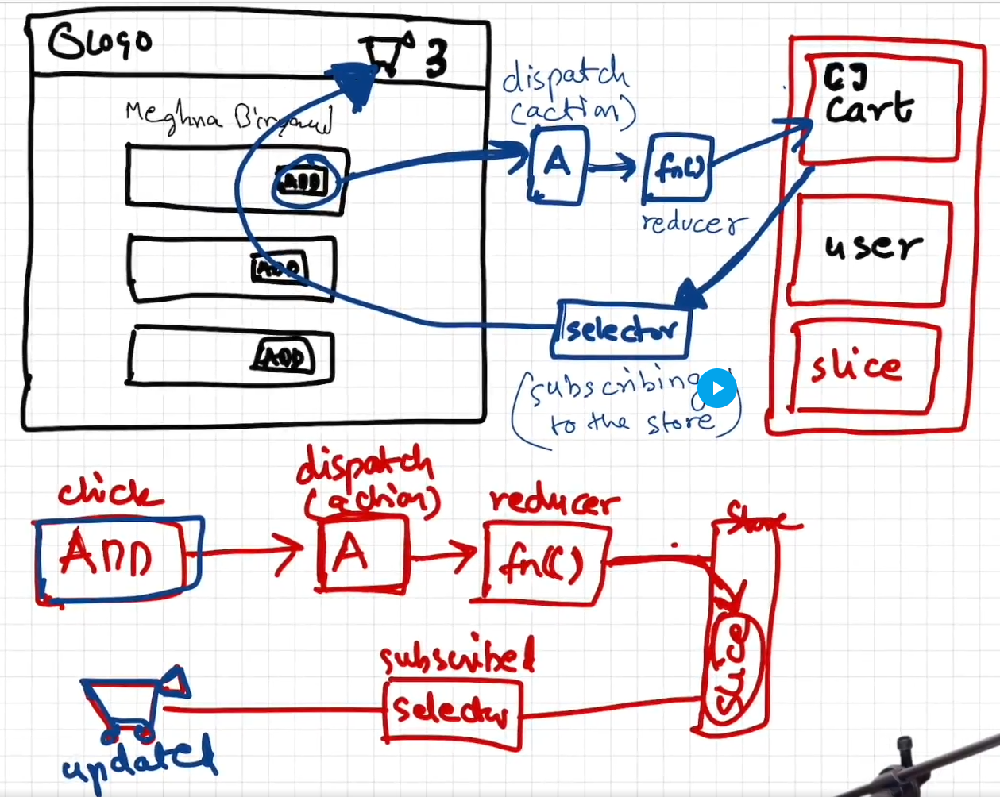

# Redux Toolkit

- Redux Store is the centralized place of storing data
- In the redux store, we have multiple slices. Slices is the logical separation of data. Example: User Slice, Cart Slice, Theme Slice
- We can't directly modify the slice data. Example: If we need to add item to cart, then on clicking add button, we need to dispatch an action that calls a reducer function and that reducer function internally modifies the cart.

```
Click on Add Button -> Dispatch an action -> Calls a reducer function -> Modifies the Cart
```

- We use selector to read data from store. This phenomena is called subscribing to the store.
- Cart Component Subscribes to Cart Slice and When data changes in cart slice, it gets automcatically synced to all components who has subscribed with it



## Installation

```
npm i @reduxjs/toolkit
npm i react-redux
```

## Implementation

- Create a store

```js
// appStore.js
import { configureStore } from "@reduxjs/toolkit";
import cartReducer from "./cartSlice";

const appStore = configureStore({
  reducer: {
    cart: cartReducer,
  },
});

export default appStore;
```

- Create a slice

```js
// cartSlice.js
import { createSlice } from "@reduxjs/toolkit";

const cartSlice = createSlice({
  name: "cart",
  initialState: {
    items: [],
  },
  reducers: {
    addItem: (state, action) => {
      state.items.push(action.payload);
    },
    removeItem: (state) => {
      state.items.pop();
    },
    clearCart: (state) => {
      state.items.length = 0;
    },
  },
});

export const { addItem, removeItem, clearCart } = cartSlice.actions;

export default cartSlice.reducer;
```

- Wrap the store in the component

```js
// App.jsx code
<Provider store={appStore}>
  <div>Hi</div>
  <Cart />
  <Product />
</Provider>
```

- To get data from the store / To subscribe to the store, use the useSelector hook

```js
// Cart.js
import { useSelector } from "react-redux";

function Cart() {
  // Subscribing to the store using selector
  const cartItems = useSelector((store) => store.cart.items);

  return <div>Cart ({cartItems.length} Items)</div>;
}

export default Cart;
```

- To dispatch any action to the store, use the useDispatch hook

```js
// Product.js
import { useDispatch } from "react-redux";
import { addItem, clearCart } from "../store/cartSlice";

function Product() {
  const dispatch = useDispatch();
  const handleAddItem = (item) => {
    // Dispatch an action
    dispatch(addItem(item));
  };
  const productItems = ["Apple", "Banana", "Mango", "Strawberry"];
  return (
    <div>
      Add Items
      <button onClick={() => dispatch(clearCart())}>Clear Cart</button>
      <ul>
        {productItems.map((item) => {
          return (
            <>
              <li>
                {item} <button onClick={() => handleAddItem(item)}>Add</button>
              </li>
            </>
          );
        })}
      </ul>
    </div>
  );
}

export default Product;
```

## Interview Questions

- Never subscribe to the whole store

```js
// Efficient
const cartItems = useSelector((store) => store.cart.items);
// Inefficient way
const store = useSelector((store) => store);
const cartItems = store.cart.items;
```

- In earlier version of the redux, redux tells that dont mutate the state. We need to create a new state and return that state but in the new redux i.e. redux-toolkit, redux tells that we have to mutate the state ourself and we don't need to return state now. But behind the scene redux is creating a immutable state. So, basically it is not asking developers to implement what was done in old version of redux. Redux uses Immer to handle this state handling.

- Dont try to assign a new object to the state. It will not work.

```js
// Wrong: Becoz we are try to set a new reference of object to the state variable.
clearCart: (state) => {
      state = []
    },
// Right
clearCart: (state) => {
      state.items.length = 0;
    },
```

- Redux Toolkit tells that either mutate the existing state or return a new state.

```js
// Right
clearCart: (state) => {
      state.items.length = 0;
    },
// Right
clearCart: (state) => {
      return { items: [] }
    },
```
